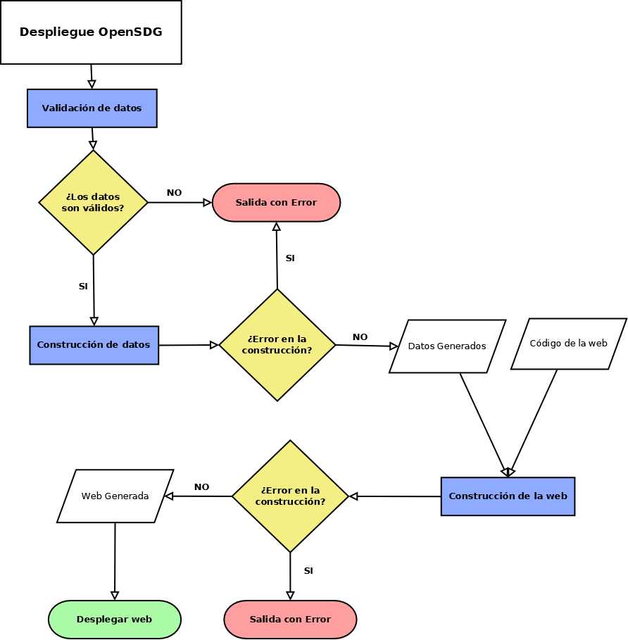

# OpenSDG

Herramienta para la carga y visualización de datos relacionados con los [Objetivos de Desarrollo Sostenible](https://www.un.org/sustainabledevelopment/sustainable-development-goals/) definidos por Naciones Unidas.
Este proyecto está basado en [OpenSDG](https://github.com/open-sdg/open-sdg).

## Dependencias

Antes de poder comenzar con el despliegue será necesario tener instalado:

* **ruby@2.5.5**
* **python@3.8**
  
### Instalación de dependencias Windows

Para instalar las dependencias habrá que acceder a las correspondientes webs de [Ruby](https://www.ruby-lang.org/en/news/2019/03/15/ruby-2-5-5-released/) y [Python](https://www.python.org/downloads/release/python-380/) para instalar las versiones requeridas.

### Instalación de dependencias Linux

Para instalar las versiones requeridas se ejecutará lo siguiente en una terminal:

````sh
$ sudo apt update

$ sudo apt install git curl libssl-dev libreadline-dev zlib1g-dev autoconf bison build-essential libyaml-dev libreadline-dev libncurses5-dev libffi-dev libgdbm-dev

$ curl -sL https://github.com/rbenv/rbenv-installer/raw/master/bin/rbenv-installer | bash -

$ echo 'export PATH="$HOME/.rbenv/bin:$PATH"' >> ~/.bashrc

$ echo 'eval "$(rbenv init -)"' >> ~/.bashrc

$ source ~/.bashrc

$ rbenv install 2.5.5

$ rbenv global 2.5.5

$ sudo apt-get install python=3.8

$ gem install bundler

````

## Construcción y Despliegue



El proceso para la construcción y despliegue del proyecto pasa por diversas fases entre las que se pueden destacar la <ins>construcción de los datos</ins> y la <ins>construcción de la web</ins>, esto se realiza siguiendo una serie de pasos que se detallaran a continuación.

1) Lo primero será validar y construir los datos.Este paso ha de realizarse siempre antes de ejecutar la construcción de la web ya que serán necesarios los archivos construidos de datos para la construcción de la web.<br>
Para realizar la validación y construcción se ha facilitado un script escrito en Python que habrá que ejecutar dentro del directorio **opensdg-datos/src**.<br>
Para ejecutar dicho script bastará con ejecutar lo siguiente dentro del directorio **opensdg-datos/src**:

````
python scripts/build_data.py
```` 

2) Una vez validados y construidos los datos se generará un directorio llamado **_site** que contiene todos los datos y metadatos codificados en archivos CSV y JSON.<br>
Este directorio habrá que renombrarlo a **opensdg-datos** y, una vez renombrado, habrá que mover este directorio a **opensdg-web/src**, para esto ejecutamos lo siguiente dentro del directorio **opensdg-datos/src**:

```` 
mv _site opensdg-datos & mv opensdg-datos ../../opensdg-web
```` 

3) Tras generar y mover los datos tendremos que desplazarnos al directorio **opensdg-web/src** y ejecutar lo siguiente:

```` 
bundle exec jekyll build
````

&emsp;&emsp;También es posible servir directamente la web sin necesidad de pasar por el paso de build o de utilizar un servidor propio, esto es especialmente útil para pruebas en local. Para esto, bastará con ejecutar el siguiente comando:

````
bundle exec jekyll serve
```` 

4) Si todo ha salido bien se habrá generado un directorio **_site**, este directorio contendrá la web estática así como los datos ya incluidos dentro de ella. Este directorio **_site** se podrá servir estáticamente mediante un servidor web HTTP, por ejemplo Apache.


Para automatizar el proceso de instalación de dependencias y construcción de la web se facilitan dos scripts **install-dependencies.sh** que instalará todas las dependencias necesarias para el correcto funcionamiento del proyecto y **build.sh** que realizará la construcción de la web y generará una carpeta llamada web que se ubicará en la raíz del proyecto. Además se ha creado también el script **serve.sh** en caso de querer servir directamente sin necesidad de pasar por el paso de construcción.
